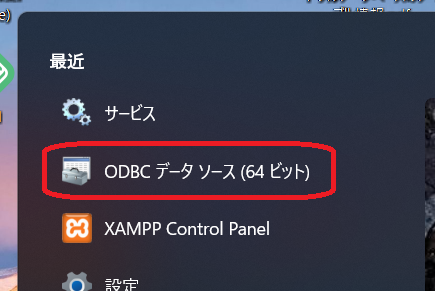
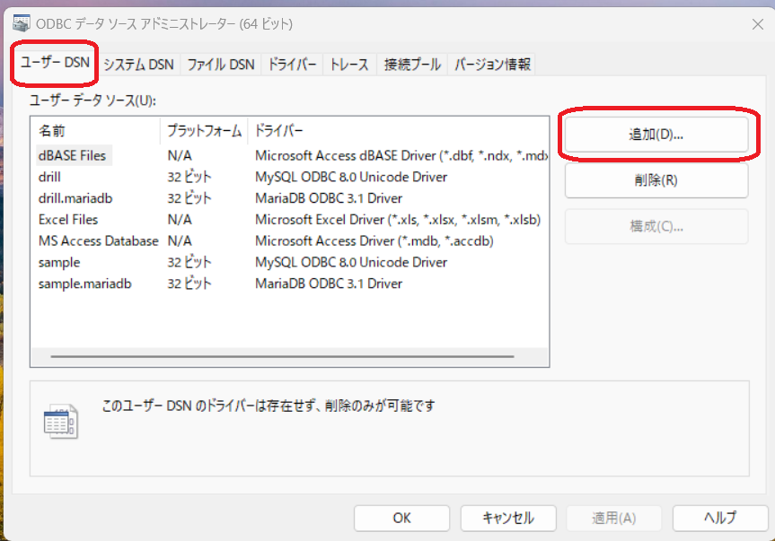
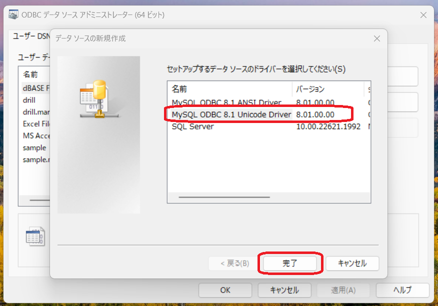
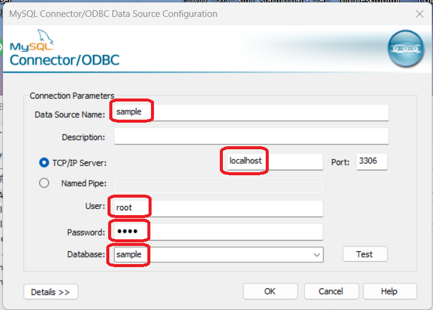
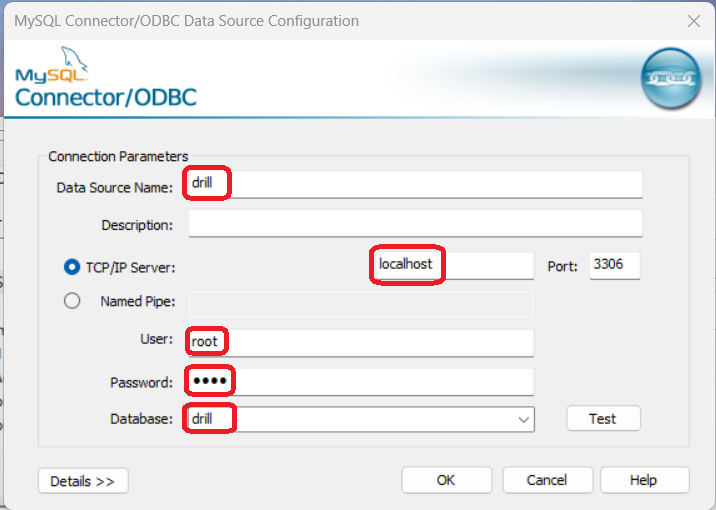

## 1. odbcドライバーのインストール
- 「mysql-connector-odbc-8.1.0-winx64.msi」をダブルクリックして、インストーラを実行
- 設定の変更はせず、「Next」で進める

## 2. ユーザーDSNの設定
### 1. ODBCデータソース(64ビット)起動

  

### 2. 「ユーザーDSN」タブで「追加」ボタンクリック

  

### 3. ドライバーの選択画面で、「MySQL ODBC 8.1 Unicode Driver」を選択し、「完了」ボタンクリック

  

### 4. ユーザーDSNの各項目を設定(sample)
- Data Source Name: sample
- TCP/IP Server: localhost
- User: root
- Password: pass
- Database: sample

  

### 5. 上の2,3の手順をもう一度行い、ユーザーDSNの各項目を設定(drill)
- Data Source Name: drill
- TCP/IP Server: localhost
- User: root
- Password: pass
- Database: drill

  

